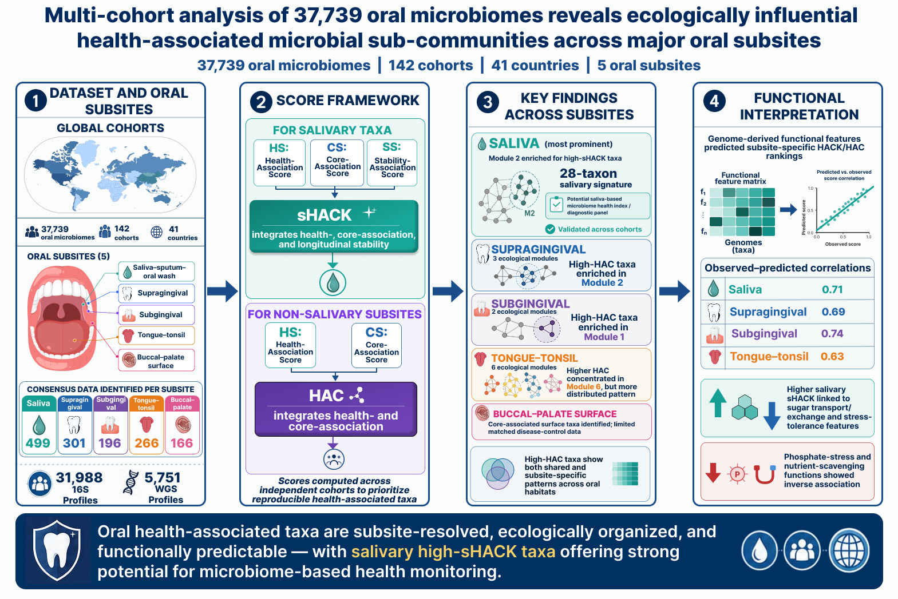

# MetaOral_Atlas

This repository contains the analysis code and results supporting "Multi-cohort analysis of 37,739 oral microbiomes reveals ecologically influential health-associated microbial sub-communities across five oral sub-sites" — a large-scale, subsite-resolved meta-analysis of the human oral microbiome using 37,739 publicly available microbiome profiles spanning 142 cohorts across 41 countries.

The study introduces the sHACK (salivary Health, Core, and Stability Association) and HAC (Health and Core Association) scoring frameworks to identify taxa that are reproducibly linked to oral health, ecological centrality, and — in saliva — longitudinal stability, across four oral habitats: saliva, supragingival plaque, subgingival plaque, and tongue-tonsil. The repository also includes co-abundance module analysis, cross-cohort validation of health-associated taxa panels, and genome-derived functional profiling that predicts sHACK/HAC scores from microbial functional potential.

## Datasets used are as follows

Cohort-level metadata for all discovery and validation datasets used in this study (Supplementary Table S1), covering five oral subsites. Each subsheet below corresponds exactly to the equivalent sheet in `Table_S1.xlsx`.

<b>ST1A</b> — Details of the 105 discovery study cohorts from Saliva-Sputum-Oral Wash Subsite investigated for computing the association of the 499 taxa with three properties of Core-Association, Stability-Association and Health-Association

| # | Study Cohort | Study Name | Sample Size | Control Count | Disease Count | Oral-Subsite | Country | Sequencing Strategy | Accession No. | DOI |
|---|---|---|---|---|---|---|---|---|---|---|
| 1 | AcharyaA_2017 | AcharyaA_2017 | 49 | 49 | 0 | saliva_sputum_oral_wash | IND | 16s | PRJNA323410 | https://doi.org/10.1111/odi.12676 |
| 2 | BhushanB_2019 | BhushanB_2019 | 39 | 39 | 0 | saliva_sputum_oral_wash | IND | 16s | PRJNA419274 | https://doi.org/10.1080/20002297.2019.1581513 |
| 3 | BritoIL_2016 | BritoIL_2016 | 135 | 135 | 0 | saliva_sputum_oral_wash | FJI | WGS | PRJNA217052 | https://doi.org/10.1038/nature18927 |
| 4 | CaselliE_2020 | CaselliE_2020 | 40 | 40 | 0 | saliva_sputum_oral_wash | ITA | WGS | PRJEB36291 | https://doi.org/10.1186/s12866-020-01801-y |
| 5 | ChaudhariD_2020 | ChaudhariD_2020 | 27 | 27 | 0 | saliva_sputum_oral_wash | IND | 16s | PRJNA438728 | https://doi.org/10.1038/s41598-020-62195-5 |
| 6 | ChenL_2022 | ChenL_2022 | 62 | 62 | 0 | saliva_sputum_oral_wash | SGP | WGS | PRJNA762543 | https://doi.org/10.1080/19490976.2022.2070392 |
| 7 | CheungM_2022 | CheungM_2022 | 759 | 759 | 0 | saliva_sputum_oral_wash | CHN | 16s | PRJNA778006 | https://doi.org/10.1128/spectrum.02410-21 |
| 8 | CheungM_2022 | CheungM_2022_exposure | 183 | 183 | 0 | saliva_sputum_oral_wash | CHN | 16s | PRJNA778006 | https://doi.org/10.1128/spectrum.02410-21 |
| 9 | CheungM_2023 | CheungM_2023 | 286 | 286 | 0 | saliva_sputum_oral_wash | CHN | 16s | PRJNA834584 | https://doi.org/10.1128/spectrum.02814-22 |
| 10 | CheungM_2023 | CheungM_2023_exposure | 431 | 431 | 0 | saliva_sputum_oral_wash | CHN | 16s | PRJNA834584 | https://doi.org/10.1128/spectrum.02814-22 |
| 11 | ClementeJ_2015 | ClementeJ_2015 | 10 | 10 | 0 | saliva_sputum_oral_wash | VEN | WGS | PRJNA245336 | https://doi.org/10.1126/sciadv.1500183 |
| 12 | DavidL_2014 | DavidL_2014 | 286 | 286 | 0 | saliva_sputum_oral_wash | USA | 16s | PRJEB6518 | https://doi.org/10.1186/gb-2014-15-7-r89 |
| 13 | FanX_2018 | FanX_2018b_exposure | 185 | 185 | 0 | saliva_sputum_oral_wash | USA | 16s | PRJNA434300; PRJNA434312 | https://doi.org/10.1186/s40168-018-0448-x |
| 14 | FilippisF_2015 | FilippisF_2015 | 161 | 161 | 0 | saliva_sputum_oral_wash | ITA | 16s | PRJNA236367 | https://doi.org/10.1371/journal.pone.0112373 |
| 15 | GoltsmanD_2018 | GoltsmanD_2018a | 986 | 986 | 0 | saliva_sputum_oral_wash | USA | 16s | PRJNA288562 | 10.1073/pnas.1502875112 |
| 16 | GoltsmanD_2018 | GoltsmanD_2018b | 101 | 101 | 0 | saliva_sputum_oral_wash | USA | WGS | PRJNA288562 | 10.1073/pnas.1502875112 |
| 17 | GuoS_2022 | GuoS_2022 | 136 | 136 | 0 | saliva_sputum_oral_wash | CHN | 16s | PRJNA649074; PRJNA557511 | https://doi.org/10.1042/BSR20210694 |
| 18 | HijaziK_2020 | HijaziK_2020 | 43 | 43 | 0 | saliva_sputum_oral_wash | GBR | 16s | PRJNA609244 | https://doi.org/10.1111/odi.13420 |
| 19 | JeongJ_2023 | JeongJ_2023 | 112 | 112 | 0 | saliva_sputum_oral_wash | KOR | 16s | PRJNA940351 | https://doi.org/10.1080/20002297.2023.2186591 |
| 20 | JulianM_2017 | JulianM_2017_exposure | 10 | 10 | 0 | saliva_sputum_oral_wash | USA | 16s | PRJNA330897 | http://dx.doi.org/10.1097/MD.0000000000005821 |
| 21 | KahharovaD_2019 | KahharovaD_2019 | 263 | 263 | 0 | saliva_sputum_oral_wash | USA | 16s | PRJNA575641 | https://doi.org/10.1177/0022034519889015 |
| 22 | KumpitschC_2020 | KumpitschC_2020_exposure | 33 | 33 | 0 | saliva_sputum_oral_wash | AUT | 16s | PRJEB37299 | https://doi.org/10.1038/s41598-020-73515-0 |
| 23 | LassalleF_2017 | LassalleF_2017 | 24 | 24 | 0 | saliva_sputum_oral_wash | PHL | WGS | PRJEB14383 | https://doi.org/10.1111/mec.14435 |
| 24 | LermaA_2020 | LermaA_2020 | 44 | 44 | 0 | saliva_sputum_oral_wash | ESP | 16s | PRJNA612815 | https://doi.org/10.1038/s41598-020-70141-8 |
| 25 | LiK_2022 | LiK_2022 | 29 | 29 | 0 | saliva_sputum_oral_wash | USA | 16s | PRJNA847970 | https://doi.org/10.3389/fcimb.2022.966361 |
| 26 | LiK_2022 | LiK_2022_exposure | 34 | 34 | 0 | saliva_sputum_oral_wash | USA | 16s | PRJNA847970 | https://doi.org/10.3389/fcimb.2022.966361 |
| 27 | LimM_2023 | LimM_2023 | 692 | 692 | 0 | saliva_sputum_oral_wash | KOR | 16s | PRJEB57967 | https://doi.org/10.3389/fcimb.2023.1114014 |
| 28 | LokmerA_2020 | LokmerA_2020 | 88 | 88 | 0 | saliva_sputum_oral_wash | CMR | 16s | PRJEB30836 | https://doi.org/10.1038/s41598-020-59849-9 |
| 29 | LokmerA_2020 | LokmerA_2020_exposure | 18 | 18 | 0 | saliva_sputum_oral_wash | CMR | 16s | PRJEB30836 | https://doi.org/10.1038/s41598-020-59849-9 |
| 30 | MakinenA_2023 | MakinenA_2023_exposure | 56 | 56 | 0 | saliva_sputum_oral_wash | FIN | 16s | PRJNA997108 | https://doi.org/10.1186/s40168-023-01613-y |
| 31 | MarotzC_2022 | MarotzC_2022Saa | 309 | 309 | 0 | saliva_sputum_oral_wash | USA | 16s | PRJEB50306 | https://doi.org/10.1038/s41522-022-00289-w |
| 32 | MarotzC_2022 | MarotzC_2022Sab | 184 | 184 | 0 | saliva_sputum_oral_wash | USA | WGS | PRJEB50306 | https://doi.org/10.1038/s41522-022-00289-w |
| 33 | MaruyamaH_2021 | MaruyamaH_2021 | 38 | 38 | 0 | saliva_sputum_oral_wash | JPN | 16s | PRJDB10589 | https://doi.org/10.12688/f1000research.27502.2 |
| 34 | NearingJ_2020 | NearingJ_2020 | 1214 | 1214 | 0 | saliva_sputum_oral_wash | CAN | 16s | PRJEB38175 | https://doi.org/10.1128/msphere.00451-20 |
| 35 | OnyangoS_2020 | OnyangoS_2020 | 99 | 99 | 0 | saliva_sputum_oral_wash | BEL | 16s | PRJNA601417 | https://doi.org/10.1128/AEM.01170-20 |
| 36 | OzgaA_2016 | OzgaA_2016 | 57 | 57 | 0 | saliva_sputum_oral_wash | USA | 16s | PRJNA292800 | https://doi.org/10.1002/ajpa.23033 |
| 37 | PooleA_2019 | PooleA_2019 | 231 | 231 | 0 | saliva_sputum_oral_wash | USA | 16s | PRJEB27304 | https://doi.org/10.1016/j.chom.2019.03.001 |
| 38 | PushalkarS_2020 | PushalkarS_2020 | 39 | 39 | 0 | saliva_sputum_oral_wash | USA | 16s | PRJNA602902 | https://doi.org/10.1016/j.isci.2020.100884 |
| 39 | PushalkarS_2020 | PushalkarS_2020_exposure | 80 | 80 | 0 | saliva_sputum_oral_wash | USA | 16s | PRJNA602902 | https://doi.org/10.1016/j.isci.2020.100884 |
| 40 | SohailM_2019 | SohailM_2019 | 68 | 68 | 0 | saliva_sputum_oral_wash | QAT | 16s | PRJNA587625 | https://doi.org/10.3390/microorganisms7120645 |
| 41 | StewartC_2018 | StewartC_2018_exposure | 10 | 10 | 0 | saliva_sputum_oral_wash | USA | 16s | PRJNA413706 | https://doi.org/10.7717/peerj.4693 |
| 42 | TakeshitaT_2014 | TakeshitaT_2014 | 140 | 140 | 0 | saliva_sputum_oral_wash | JPN, KOR | 16s | PRJDB2877, PRJDB2878, PRJDB2879 | https://doi.org/10.1038/srep06990 |
| 43 | TramiceA_2022 | TramiceA_2022 | 37 | 37 | 0 | saliva_sputum_oral_wash | FIN | 16s | PRJNA897843 | https://doi.org/10.1038/s41598-022-26528-w |
| 44 | TramiceA_2022 | TramiceA_2022_exposure | 21 | 21 | 0 | saliva_sputum_oral_wash | FIN | 16s | PRJNA897843 | https://doi.org/10.1038/s41598-022-26528-w |
| 45 | VogtmannE_2019 | VogtmannE_2019 | 150 | 150 | 0 | saliva_sputum_oral_wash | USA | 16s | PRJEB23323 | https://doi.org/10.1158/1055-9965.EPI-18-0312 |
| 46 | VoigtA_2015 | VoigtA_2015B | 104 | 104 | 0 | saliva_sputum_oral_wash | DEU | WGS | PRJEB28422 | https://doi.org/10.7554/eLife.42693 |
| 47 | WillisJ_2018 | WillisJ_2018 | 1302 | 1302 | 0 | saliva_sputum_oral_wash | ESP | 16s | PRJNA427101 | https://doi.org/10.1186/s40168-018-0592-3 |
| 48 | WillisJ_2022 | WillisJ_2022 | 1059 | 1059 | 0 | saliva_sputum_oral_wash | ESP | 16s | PRJNA667146 | https://doi.org/10.1038/s41522-022-00279-y |
| 49 | WolfA_2017 | WolfA_2017_exposure | 11 | 11 | 0 | saliva_sputum_oral_wash | AUT | 16s | PRJEB18476 | https://doi.org/10.1038/s41598-017-06361-2 |
| 50 | YanoY_2020 | YanoY_2020 | 118 | 118 | 0 | saliva_sputum_oral_wash | USA | 16s | PRJNA634162 | https://doi.org/10.1128/mSystems.00156-20 |
| 51 | YeoL_2019 | YeoL_2019 | 42 | 42 | 0 | saliva_sputum_oral_wash | MYS | 16s | PRJNA515166 | https://doi.org/10.12688/f1000research.17706.3 |
| 52 | YeoL_2019 | YeoL_2019_exposure | 28 | 28 | 0 | saliva_sputum_oral_wash | MYS | 16s | PRJNA515166 | https://doi.org/10.12688/f1000research.17706.3 |
| 53 | YuG_2016 | YuG_2016 | 35 | 35 | 0 | saliva_sputum_oral_wash | USA | 16s | PRJNA316469 | https://doi.org/10.1158/1055-9965.EPI-16-0538 |
| 54 | YuG_2016 | YuG_2016_exposure | 40 | 40 | 0 | saliva_sputum_oral_wash | USA | 16s | PRJNA316469 | https://doi.org/10.1158/1055-9965.EPI-16-0538 |
| 55 | ZauraE_2017 | ZauraE_2017 | 267 | 267 | 0 | saliva_sputum_oral_wash | NLD | 16s | PRJNA348169 | https://doi.org/10.1038/ismej.2016.199 |
| 56 | ZhuC_2020 | ZhuC_2020a | 60 | 60 | 0 | saliva_sputum_oral_wash | CHN | 16s | PRJNA586723 | http://dx.doi.org/10.21037/atm-20-393 |
| 57 | ZhuC_2020 | ZhuC_2020b | 120 | 120 | 0 | saliva_sputum_oral_wash | CHN | 16s | PRJNA534340 | https://doi.org/10.1177/0022034520917155 |
| 58 | ZhuJ_2021 | ZhuJ_2021_Yunnan | 671 | 671 | 0 | saliva_sputum_oral_wash | CHN | WGS | CNP0001221 | https://doi.org/10.1016/j.gpb.2021.05.001 |
| 59 | CameronS_2015 | CameronS_2015 | 70 | 70 | 0 | saliva_sputum_oral_wash | UK | 16s | PRJEB9010 | https://doi.org/10.1093/femsec/fiv091 |
| 60 | ColladoM_2018 | ColladoM_2018 | 99 | 99 | 0 | saliva_sputum_oral_wash | ESP | 16s | PRJNA361501 | https://doi.org/10.1096/fj.201700697RR |
| 61 | LaiolaM_2020 | LaiolaM_2020 | 135 | 135 | 0 | saliva_sputum_oral_wash | ITA | 16s | PRJNA605164 | https://doi.org/10.1128/AEM.00777-20 |
| 62 | MenonR_2019 | MenonR_2019 | 299 | 299 | 0 | saliva_sputum_oral_wash | CHN | 16s | PRJNA586897 | https://doi.org/10.1038/s41598-019-55056-3 |
| 63 | TakayasuL_2017 | TakayasuL_2017 | 108 | 108 | 0 | saliva_sputum_oral_wash | JPN | WGS | PRJDB5315, PRJDB4115 | https://doi.org/10.1093/dnares/dsx001 |
| 64 | BostanciN_2021 | BostanciN_2021 | 465 | 347 | 118 | saliva_sputum_oral_wash | DNK | WGS | PRJEB37731 | https://doi.org/10.3389/fcimb.2021.625229 |
| 65 | AbdelbaryM_2022 | AbdelbaryM_2022 | 27 | 12 | 15 | saliva_sputum_oral_wash | DEU | 16s | PRJNA855620 | https://doi.org/10.3389/fcimb.2022.1010853 |
| 66 | BelstromD_2017 | BelstromD_2017 | 59 | 20 | 39 | saliva_sputum_oral_wash | DNK | WGS | PRJNA396840 | https://doi.org/10.1038/s41522-017-0031-4 |
| 67 | BelstromD_2021 | BelstromD_2021 | 44 | 22 | 22 | saliva_sputum_oral_wash | DNK | WGS | PRJNA678453 | https://doi.org/10.1038/s41522-021-00247-y |
| 68 | DebeliusJ_2020 | DebeliusJ_2020 | 876 | 436 | 440 | saliva_sputum_oral_wash | CHN | 16s | PRJEB37445 | https://doi.org/10.1128/mSystems.00065-20 |
| 69 | FanX_2018b | FanX_2018b | 555 | 187 | 368 | saliva_sputum_oral_wash | USA | 16s | PRJNA434300; PRJNA434312 | https://doi.org/10.1186/s40168-018-0448-x |
| 70 | GuptaA_2022 | GuptaA_2022 | 102 | 47 | 55 | saliva_sputum_oral_wash | IND | 16s | PRJNA780671 | https://doi.org/10.1016/j.micres.2022.127055 |
| 71 | HuangC_2022 | HuangC_2022 | 40 | 20 | 20 | saliva_sputum_oral_wash | CHN | 16s | PRJNA837028 | https://doi.org/10.3389/fneur.2022.938360 |
| 72 | JiangQ_2019 | JiangQ_2019 | 90 | 43 | 47 | saliva_sputum_oral_wash | CHN | 16s | PRJNA495719 | https://doi.org/10.3389/fcimb.2018.00442 |
| 73 | LeeW_2017 | LeeW_2017 | 247 | 127 | 120 | saliva_sputum_oral_wash | CHN | 16s | PRJNA386665 | https://doi.org/10.1038/s41598-017-16418-x |
| 74 | LeeY_2025 | LeeY_2025 | 102 | 33 | 69 | saliva_sputum_oral_wash | KOR | 16s | PRJNA1148754 | https://doi.org/10.1016/j.job.2024.100591 |
| 75 | LinM_2020 | LinM_2020 | 71 | 14 | 57 | saliva_sputum_oral_wash | CHN | 16s | PRJNA578492 | https://doi.org/10.3389/fcimb.2020.00124 |
| 76 | LindheimL_2016 | LindheimL_2016 | 44 | 20 | 24 | saliva_sputum_oral_wash | AUT | 16s | PRJNA326866 | https://doi.org/10.3389/fmicb.2016.01270 |
| 77 | LiuY_2019 | LiuY_2019 | 30 | 15 | 15 | saliva_sputum_oral_wash | CHN | 16s | PRJNA484857 | http://dx.doi.org/doi:10.4317/medoral.23041 |
| 78 | LundmarkA_2019 | LundmarkA_2019 | 93 | 46 | 47 | saliva_sputum_oral_wash | SWE | 16s | PRJEB21767 | https://doi.org/10.3389/fcimb.2019.00216 |
| 79 | MoskovitzM_2021 | MoskovitzM_2021 | 60 | 16 | 44 | saliva_sputum_oral_wash | ISR | 16s | PRJNA759836 | https://doi.org/10.3389/fmicb.2021.756808 |
| 80 | NagataN_2022 | NagataN_2022 | 281 | 234 | 47 | saliva_sputum_oral_wash | JPN | WGS | PRJNA832909 | https://doi.org/10.1053/j.gastro.2022.03.054 |
| 81 | RafiqulI_2022 | RafiqulI_2022 | 37 | 15 | 22 | saliva_sputum_oral_wash | BGD | 16s | PRJNA767939 | https://doi.org/10.3389/fmed.2022.821777 |
| 82 | RiveraV_2025 | RiveraV_2025 | 74 | 27 | 47 | saliva_sputum_oral_wash | PRI | 16s | PRJEB86129 | https://doi.org/10.1038/s41598-025-13262-2 |
| 83 | RussoE_2018 | RussoE_2018 | 20 | 10 | 10 | saliva_sputum_oral_wash | ITA | 16s | PRJNA356414 | https://doi.org/10.3389/fmicb.2017.02699 |
| 84 | TakahashiY_2019 | TakahashiY_2019 | 140 | 81 | 59 | saliva_sputum_oral_wash | JPN | 16s | PRJNA525734 | https://doi.org/10.1016/j.job.2019.03.003 |
| 85 | TianN_2017 | TianN_2017 | 62 | 20 | 42 | saliva_sputum_oral_wash | USA | 16s | PRJNA321349 | https://doi.org/10.1128/AEM.03330-16 |
| 86 | TongY_2019 | TongY_2019 | 80 | 52 | 28 | saliva_sputum_oral_wash | CHN | 16s | PRJNA578951 | https://doi.org/10.3389/fcimb.2019.00475 |
| 87 | WangB_2020 | WangB_2020 | 61 | 30 | 31 | saliva_sputum_oral_wash | CHN | 16s | PRJEB38373 | https://doi.org/10.1152/ajpendo.00234.2020 |
| 88 | WangK_2016 | WangK_2016 | 108 | 36 | 72 | saliva_sputum_oral_wash | CHN | 16s | PRJNA306560 | https://doi.org/10.1038/srep22943 |
| 89 | WangQ_2019 | WangQ_2019 | 41 | 21 | 20 | saliva_sputum_oral_wash | CHN | 16s | PRJNA587078 | https://doi.org/10.1038/s41598-019-55667-w |
| 90 | WangT_2018 | WangT_2018 | 91 | 45 | 46 | saliva_sputum_oral_wash | CHN | 16s | PRJNA414355 | https://doi.org/10.1371/journal.pone.0203503 |
| 91 | WangX_2020 | WangX_2020 | 60 | 20 | 40 | saliva_sputum_oral_wash | CHN | 16s | PRJNA556311; PRJNA555458 | https://doi.org/10.3389/fmicb.2020.00629 |
| 92 | YuF_2020 | YuF_2020 | 40 | 10 | 30 | saliva_sputum_oral_wash | CHN | 16s | PRJNA542018 | https://doi.org/10.1186/s12866-020-01733-7 |
| 93 | ZellerG_2014 | ZellerG_2014B | 338 | 160 | 178 | saliva_sputum_oral_wash | FRA | WGS | PRJEB28422 | https://doi.org/10.7554/eLife.42693 |
| 94 | ZhengX_2017 | ZhengX_2017 | 42 | 21 | 21 | saliva_sputum_oral_wash | CHN | 16s | PRJNA339212 | https://doi.org/10.1038/s41598-017-07042-w |
| 95 | ZhuC_2018 | ZhuC_2018 | 84 | 51 | 33 | saliva_sputum_oral_wash | CHN | 16s | PRJNA493618 | https://doi.org/10.3389/fcimb.2018.00423 |
| 96 | ZiganshinaE_2020 | ZiganshinaE_2020 | 26 | 12 | 14 | saliva_sputum_oral_wash | RUS | 16s | PRJNA598080 | https://doi.org/10.1155/2020/2681791 |
| 97 | ArmstrongA_2023 | ArmstrongA_2023a | 770 | 323 | 447 | saliva_sputum_oral_wash | USA | 16s | PRJEB62655 | https://doi.org/10.1016/j.ebiom.2023.104731 |
| 98 | ArmstrongA_2023 | ArmstrongA_2023b | 123 | 64 | 59 | saliva_sputum_oral_wash | USA | WGS | PRJEB62577 | https://doi.org/10.1016/j.ebiom.2023.104731 |
| 99 | MakinenA_2023 | MakinenA_2023 | 108 | 40 | 68** | saliva_sputum_oral_wash | FIN | 16s | PRJNA997108 | https://doi.org/10.1186/s40168-023-01613-y |
| 100 | JulianM_2017 | JulianM_2017 | 40 | 10* | 40 | saliva_sputum_oral_wash | USA | 16s | PRJNA330897 | http://dx.doi.org/10.1097/MD.0000000000005821 |
| 101 | KumpitschC_2020 | KumpitschC_2020 | 125 | 33* | 125 | saliva_sputum_oral_wash | AUT | 16s | PRJEB37299 | https://doi.org/10.1038/s41598-020-73515-0 |
| 102 | WolfA_2017 | WolfA_2017 | 11 | 11* | 11 | saliva_sputum_oral_wash | AUT | 16s | PRJEB18476 | https://doi.org/10.1038/s41598-017-06361-2 |
| 103 | DanckertN_2024 | DanckertN_2024 | 334 | 0 | 334 | saliva_sputum_oral_wash | GBR | WGS | PRJNA957107 | https://doi.org/10.1093/rheumatology/keae045 |
| 104 | MedeirosM_2023 | MedeirosM_2023 | 150 | 0 | 150 | saliva_sputum_oral_wash | USA | 16s | PRJNA906710 | https://doi.org/10.1186/s40168-023-01677-w |
| 105 | RaychaudhuriS_2025 | RaychaudhuriS_2025 | 82 | 0 | 82 | saliva_sputum_oral_wash | USA | WGS | PRJNA1265886 | https://doi.org/10.1038/s41522-025-00725-7 |
|  |  | Total | 18800 | 15244 | 3488 |  |  |  |  |  |
|  |  |  |  | * These samples are already counted in their exposure studies (JulianM_2017_exposure, KumpitschC_2020_exposure, WolfA_2017_exposure) | ** 34 samples are diseases samples while 34 are post-treatment samples.Together we have considered here as Disease, however in the downstream analysis these 34 samples are neither considered control nor diseased as they were used only in longitudinal analysis (Stability Association Analysis) |  |  |  |  |  |
|  |  |  |  |  |  |  |  |  |  |  |

<b>ST1B</b> — Details of the 24 study cohorts from Supragingival Subsite investigated for computing the association of the 301 taxa with two properties of Core-Association, and Health-Association.

| # | Study Cohort | Study Name | Sample Size | Control Count | Disease Count | Oral-Subsite | Country | Sequencing Strategy | Accession No. | DOI |
|---|---|---|---|---|---|---|---|---|---|---|
| 1 | CaselliE_2020 | CaselliE_2020 | 40 | 40 | 0 | supragingival_subsite | ITA | WGS | PRJEB36291 | https://doi.org/10.1186/s12866-020-01801-y |
| 2 | ChenC_2018 | ChenC_2018_exposure | 12 | 12 | 0 | supragingival_subsite | USA | 16s | PRJNA321534 | https://doi.org/10.1038/s41396-017-0037-1 |
| 3 | FerrerM_2020 | FerrerM_2020 | 75 | 75 | 0 | supragingival_subsite | ESP | 16s | PRJNA629283 | https://doi.org/10.3389/fcimb.2020.00465 |
| 4 | GanesanS_2020 | GanesanS_2020_exposure | 24 | 24 | 0 | supragingival_subsite | USA | WGS | PRJNA544061; PRJNA548383; PRJNA508385 | https://doi.org/10.1126/sciadv.aaz0108 |
| 5 | HMP_2012 | HMP_2012 | 132 | 132 | 0 | supragingival_subsite | USA | WGS | cMD | https://doi.org/10.1038/nature11234 |
| 6 | JiangW_2015 | JiangW_2015 | 64 | 64 | 0 | supragingival_subsite | CHN | 16s | PRJNA267061 | https://doi.org/10.1371/journal.pone.0124631 |
| 7 | JulianM_2017 | JulianM_2017_exposure | 20 | 20 | 0 | supragingival_subsite | USA | 16s | PRJNA330897 | http://dx.doi.org/10.1097/MD.0000000000005821 |
| 8 | ShaiberA_2020 | ShaiberA_2020a | 35 | 35 | 0 | supragingival_subsite | USA | 16s | PRJNA625082 | https://doi.org/10.1186/s13059-020-02195-w |
| 9 | ShaiberA_2020 | ShaiberA_2020b | 35 | 35 | 0 | supragingival_subsite | USA | WGS | PRJNA625082 | https://doi.org/10.1186/s13059-020-02195-w |
| 10 | YuG_2016 | YuG_2016 | 26 | 26 | 0 | supragingival_subsite | USA | 16s | PRJNA316469 | https://doi.org/10.1158/1055-9965.EPI-16-0538 |
| 11 | YuG_2016 | YuG_2016_exposure | 39 | 39 | 0 | supragingival_subsite | USA | 16s | PRJNA316469 | https://doi.org/10.1158/1055-9965.EPI-16-0538 |
| 12 | ZhangY_2022 | ZhangY_2022 | 40 | 40 | 0 | supragingival_subsite | CHN | 16s | PRJNA826664 | https://doi.org/10.3389/fcimb.2022.1016523 |
| 13 | ChenC_2018 | ChenC_2018 | 145 | 30 | 115 | supragingival_subsite | USA | 16s | PRJNA321534 | https://doi.org/10.1038/s41396-017-0037-1 |
| 14 | GalimanasV_2014 | GalimanasV_2014 | 24 | 11 | 13 | supragingival_subsite | USA | 16s | PRJEB6047 | https://doi.org/10.1186/2049-2618-2-32 |
| 15 | HavsedK_2021 | HavsedK_2021 | 40 | 20 | 20 | supragingival_subsite | SWE | 16s | PRJNA681486 | https://doi.org/10.3389/fcimb.2021.716493 |
| 16 | JesusV_2021 | JesusV_2021 | 323 | 158 | 165 | supragingival_subsite | CAN | 16s | PRJNA714139; PRJNA555320 | https://doi.org/10.3389/fmicb.2021.683685 |
| 17 | NajmanovaL_2021 | NajmanovaL_2021 | 35 | 20 | 15 | supragingival_subsite | CZE | 16s | PRJNA291567 | https://doi.org/10.3389/fcimb.2021.602643 |
| 18 | PangL_2021 | PangL_2021 | 40 | 20 | 20 | supragingival_subsite | CHN | WGS | PRJNA766357 | 10.3389/fcimb.2021.740981 |
| 19 | ProctorD_2018 | ProctorD_2018 | 8790 | 8252 | 538 | supragingival_subsite | USA | 16s | PRJNA362643 | https://doi.org/10.1038/s41467-018-02900-1 |
| 20 | SantosA_2021 | SantosA_2021 | 50 | 25 | 25 | supragingival_subsite | PRT | 16s | PRJNA679485 | https://doi.org/10.3389/fmicb.2021.610370 |
| 21 | XiaoC_2016 | XiaoC_2016 | 145 | 29 | 116 | supragingival_subsite | CHN | 16s | PRJNA325084 | https://doi.org/10.3389/fmicb.2016.01145 |
| 22 | ZhangX_2015 | ZhangX_2015 | 143 | 51 | 92 | supragingival_subsite | CHN | WGS | PRJEB6997 | https://doi.org/10.1038/nm.3914 |
| 23 | ZhengH_2015 | ZhengH_2015 | 24 | 10 | 14 | supragingival_subsite | CHN | 16s | PRJNA253517 | https://doi.org/10.1038/srep10948 |
| 24 | JulianM_2017 | JulianM_2017 | 80 | 20* | 80 | supragingival_subsite | USA | 16s | PRJNA330897 | http://dx.doi.org/10.1097/MD.0000000000005821 |
|  |  | Total | 10381 | 9168 | 1213 |  |  |  |  |  |
|  |  |  |  | * These samples are already counted in their exposure studies (JulianM_2017_exposure) |  |  |  |  |  |  |

<b>ST1C</b> — Details of the 11 study cohorts from Subgingival Subsite investigated for computing the association of the 196 taxa with two properties of Core-Association, and Health-Association

| # | Study Cohort | Study Name | Sample Size | Control Count | Disease Count | Oral-Subsite | Country | Sequencing Strategy | Accession No. | DOI |
|---|---|---|---|---|---|---|---|---|---|---|
| 1 | CaselliE_2020 | CaselliE_2020 | 20 | 20 | 0 | subgingival_subsite | ITA | WGS | PRJEB36291 | https://doi.org/10.1186/s12866-020-01801-y |
| 2 | GanesanS_2020 | GanesanS_2020 | 25 | 25 | 0 | subgingival_subsite | USA | WGS | PRJNA544061; PRJNA548383; PRJNA508385 | https://doi.org/10.1126/sciadv.aaz0108 |
| 3 | GanesanS_2020 | GanesanS_2020_exposure | 73 | 73 | 0 | subgingival_subsite | USA | WGS | PRJNA544061; PRJNA548383; PRJNA508385 | https://doi.org/10.1126/sciadv.aaz0108 |
| 4 | ShoerS_2023 | ShoerS_2023 | 310 | 310 | 0 | subgingival_subsite | ISR | WGS | PRJEB64861 | https://doi.org/10.1038/s41467-023-41042-x |
| 5 | AndersonA_2013 | AndersonA_2013 | 40 | 23 | 17 | subgingival_subsite | SDN | 16s | PRJNA217469 | https://dx.doi.org/10.1371%2Fjournal.pone.0084960 |
| 6 | BelstromD_2021 | BelstromD_2021 | 38 | 20 | 18 | subgingival_subsite | DNK | WGS | PRJNA678453 | https://doi.org/10.1038/s41522-021-00247-y |
| 7 | GalimanasV_2014 | GalimanasV_2014 | 24 | 11 | 13 | subgingival_subsite | USA | 16s | PRJEB6047 | https://doi.org/10.1186/2049-2618-2-32 |
| 8 | GhensiP_2019 | GhensiP_2019 | 113 | 35 | 78 | subgingival_subsite | ITA | WGS | PRJNA547717 | https://doi.org/10.1038/s41522-020-00155-7 |
| 9 | LenartovaM_2021 | LenartovaM_2021 | 153 | 91 | 62 | subgingival_subsite | USA, SVK, MEX, KOR, HUN, UKR, VNM, SAU, ARM, RUS | 16s | PRJNA670573 | https://doi.org/10.3389/fcimb.2021.629723 |
| 10 | MarotzC_2022 | MarotzC_2022Su | 1108 | 780 | 328 | subgingival_subsite | USA | 16s | PRJEB50261 | https://doi.org/10.1038/s41522-022-00289-w |
| 11 | MonteiroM_2021 | MonteiroM_2021 | 70 | 30 | 40 | subgingival_subsite | BRA | 16s | PRJNA606501 | https://doi.org/10.1038/s41598-020-80372-4 |
|  |  | Total | 1974 | 1418 | 556 |  |  |  |  |  |

<b>ST1D</b> — Details of the 18 study cohorts from Tongue-Tonsil Subsite investigated for computing the association of the 266 taxa with two properties of Core-Association, and Health-Association.

| # | Study Cohort | Study Name | Sample Size | Control Count | Disease Count | Oral-Subsite | Country | Sequencing Strategy | Accession No. | DOI |
|---|---|---|---|---|---|---|---|---|---|---|
| 1 | BassisC_2014 | BassisC_2014_exposure | 12 | 12 | 0 | tongue_tonsil_subsite | USA | 16s | PRJNA248297 | https://doi.org/10.1186/2049-2618-2-27 |
| 2 | CaselliE_2020 | CaselliE_2020 | 20 | 20 | 0 | tongue_tonsil_subsite | ITA | WGS | PRJEB36291 | https://doi.org/10.1186/s12866-020-01801-y |
| 3 | FerrettiP_2018 | FerrettiP_2018 | 24 | 24 | 0 | tongue_tonsil_subsite | ITA | WGS | PRJNA352475 | https://doi.org/10.1016/j.chom.2018.06.005 |
| 4 | FloresG_2014 | FloresG_2014 | 895 | 895 | 0 | tongue_tonsil_subsite | USA | 16s | PRJEB5726 | https://doi.org/10.1186/s13059-014-0531-y |
| 5 | HMP_2012 | HMP_2012 | 142 | 142 | 0 | tongue_tonsil_subsite | USA | WGS | cMD | https://doi.org/10.1038/nature11234 |
| 6 | HalboubE_2020 | HalboubE_2020 | 23 | 23 | 0 | tongue_tonsil_subsite | SAU | 16s | PRJNA605810 | https://doi.org/10.1186/s12866-020-01883-8 |
| 7 | HalboubE_2020 | HalboubE_2020_exposure | 29 | 29 | 0 | tongue_tonsil_subsite | SAU | 16s | PRJNA605810 | https://doi.org/10.1186/s12866-020-01883-8 |
| 8 | LarsonP_2022 | LarsonP_2022 | 125 | 125 | 0 | tongue_tonsil_subsite | USA | WGS | PRJNA699281 | https://doi.org/10.1038/s43587-022-00287-9 |
| 9 | MaruyamaH_2021 | MaruyamaH_2021 | 38 | 38 | 0 | tongue_tonsil_subsite | JPN | 16s | PRJDB10589 | https://doi.org/10.12688/f1000research.27502.2 |
| 10 | ShaiberA_2020 | ShaiberA_2020a | 40 | 40 | 0 | tongue_tonsil_subsite | USA | 16s | PRJNA625082 | https://doi.org/10.1186/s13059-020-02195-w |
| 11 | ShaiberA_2020 | ShaiberA_2020b | 36 | 36 | 0 | tongue_tonsil_subsite | USA | WGS | PRJNA625082 | https://doi.org/10.1186/s13059-020-02195-w |
| 12 | WidyarmanA_2021 | WidyarmanA_2021 | 20 | 20 | 0 | tongue_tonsil_subsite | IDN | 16s | PRJNA745286 | https://doi.org/10.3389/froh.2021.738306 |
| 13 | YuG_2016 | YuG_2016 | 38 | 38 | 0 | tongue_tonsil_subsite | USA | 16s | PRJNA316469 | https://doi.org/10.1158/1055-9965.EPI-16-0538 |
| 14 | YuG_2016 | YuG_2016_exposure | 41 | 41 | 0 | tongue_tonsil_subsite | USA | 16s | PRJNA316469 | https://doi.org/10.1158/1055-9965.EPI-16-0538 |
| 15 | BelstromD_2021 | BelstromD_2021 | 36 | 16 | 20 | tongue_tonsil_subsite | DNK | WGS | PRJNA678453 | https://doi.org/10.1038/s41522-021-00247-y |
| 16 | GalimanasV_2014 | GalimanasV_2014 | 24 | 11 | 13 | tongue_tonsil_subsite | USA | 16s | PRJEB6047 | https://doi.org/10.1186/2049-2618-2-32 |
| 17 | SarkarP_2021 | SarkarP_2021 | 100 | 50 | 50 | tongue_tonsil_subsite | IND | 16s | PRJNA666746 | https://doi.org/10.3389/fonc.2021.614448 |
| 18 | TangB_2023 | TangB_2023 | 50 | 10 | 40 | tongue_tonsil_subsite | CHN | 16s | PRJNA873889 | https://doi.org/10.1016/j.heliyon.2023.e13224 |
|  |  | Total | 1693 | 1570 | 123 |  |  |  |  |  |

<b>ST1E</b> — Details of the 11 study cohorts from Buccal-Palate Other-Surface Subsite investigated for computing the association of the 166 taxa with two properties of Core-Association, and Health-Association.

| # | Study Cohort | Study Name | Sample Size | Control Count | Disease Count | Oral-Subsite | Country | Sequencing Strategy | Accession No. | DOI |
|---|---|---|---|---|---|---|---|---|---|---|
| 1 | BassisC_2014 | BassisC_2014_exposure | 12 | 12 | 0 | buccal_palate_other_surface_subsite | USA | 16s | PRJNA248297 | https://doi.org/10.1186/2049-2618-2-27 |
| 2 | BurchamZ_2020 | BurchamZ_2020 | 195 | 195 | 0 | buccal_palate_other_surface_subsite | USA | 16s | PRJEB33119 | https://doi.org/10.1038/s41598-020-59016-0 |
| 3 | CaselliE_2020 | CaselliE_2020 | 40 | 40 | 0 | buccal_palate_other_surface_subsite | ITA | WGS | PRJEB36291 | https://doi.org/10.1186/s12866-020-01801-y |
| 4 | HMP_2012 | HMP_2012 | 120 | 120 | 0 | buccal_palate_other_surface_subsite | USA | WGS | cMD | https://doi.org/10.1038/nature11234 |
| 5 | JulianM_2017 | JulianM_2017_exposure | 20 | 20 | 0 | buccal_palate_other_surface_subsite | USA | 16s | PRJNA330897 | http://dx.doi.org/10.1097/MD.0000000000005821 |
| 6 | StewartC_2018 | StewartC_2018_exposure | 10 | 10 | 0 | buccal_palate_other_surface_subsite | USA | 16s | PRJNA413706 | https://doi.org/10.7717/peerj.4693 |
| 7 | ThomasA_2014 | ThomasA_2014_exposure | 19 | 19 | 0 | buccal_palate_other_surface_subsite | BRA | 16s | PRJNA255332 | https://doi.org/10.1186/s12866-014-0250-2 |
| 8 | YuG_2016 | YuG_2016 | 30 | 30 | 0 | buccal_palate_other_surface_subsite | USA | 16s | PRJNA316469 | https://doi.org/10.1158/1055-9965.EPI-16-0538 |
| 9 | YuG_2016 | YuG_2016_exposure | 41 | 41 | 0 | buccal_palate_other_surface_subsite | USA | 16s | PRJNA316469 | https://doi.org/10.1158/1055-9965.EPI-16-0538 |
| 10 | StehlikovaZ_2019 | StehlikovaZ_2019 | 175 | 34 | 141 | buccal_palate_other_surface_subsite | CZE | 16s | PRJNA521448 | https://doi.org/10.3390/microorganisms7120636 |
| 11 | JulianM_2017 | JulianM_2017 | 80 | 20* | 80 | buccal_palate_other_surface_subsite | USA | 16s | PRJNA330897 | http://dx.doi.org/10.1097/MD.0000000000005821 |
|  |  | Total | 742 | 521 | 221 |  |  |  |  |  |
|  |  |  |  | * These samples are already counted in their exposure studies (JulianM_2017_exposure) |  |  |  |  |  |  |

<b>ST1F</b> — Details of the 19 validation study cohorts from Saliva-Sputum-Oral Wash Subsite validating 499 taxa with three properties of Core-Association, Stability-Association, Health-Association and co-abundance modules.

| # | Study Cohort | Study Name | Sample Size | Control Count | Disease Count | Other Sample Count | Disease | Oral-Subsite | Country | Sequencing Strategy | Accession No. | DOI |
|---|---|---|---|---|---|---|---|---|---|---|---|---|
| 1 | ChenJ_2021 | ChenJ_2021 | 75 | 27 | 48 | 0 | OSCC, Oral_Verrucous_Hyperplasia | saliva_sputum_oral_wash | CHN | 16s | PRJEB39064 | https://doi.org/10.3389/fcimb.2021.663068 |
| 2 | ChenX_2025 | ChenX_2025 | 206 | 102 | 104 | 0 | Hypertension | saliva_sputum_oral_wash | CHN | 16s | PRJNA1161685 | https://doi.org/10.1080/20002297.2025.2489603 |
| 3 | CirsteaM_2022 | CirsteaM_2022 | 98 | 54 | 44 | 0 | Alzheimer's Disease (AD) | saliva_sputum_oral_wash | CAN | 16s | PRJNA770746 | https://doi.org/10.3233/JAD-215520 |
| 4 | FanX_2018 | FanX_2018a | 464 | 310 | 154 | 0 | Head_And_Neck_Cancer | saliva_sputum_oral_wash | USA | 16s | PRJNA434300; PRJNA434312 | https://doi.org/10.1186/s40168-018-0448-x |
| 5 | FinkelsteinS_2025 | FinkelsteinS_2025 | 679 | 530 | 149 | 0 | Gestational Diabetes Mellitus (GDM) | saliva_sputum_oral_wash | ISR | 16s | PRJEB58050 | https://doi.org/10.1101/2025.09.29.679276 |
| 6 | IglesiasA_2024 | IglesiasA_2024 | 124 | 50 | 74 | 0 | Periodontitis | saliva_sputum_oral_wash | PRT, ESP | 16s | PRJNA774299, PRJNA774981 | https://doi.org/10.3389/fcimb.2024.1405699 |
| 7 | JiY_2020 | JiY_2020 | 80 | 80 | 0 | 0 | H. Pylori infection | saliva_sputum_oral_wash | CHN | 16s | PRJNA503603 | https://doi.org/10.1186/s12903-020-01070-1 |
| 8 | LiuY_2021 | LiuY_2021 | 45 | 21 | 24 | 0 | T2D | saliva_sputum_oral_wash | CHN | 16s | PRJNA609009 | https://doi.org/10.1016/j.archoralbio.2021.105118 |
| 9 | NearingJ_2023 | NearingJ_2023 | 608 | 259 | 349 | 0 | Breast_Cancer, CRC, Prostate_Cancer | saliva_sputum_oral_wash | CAN | 16s | PRJEB56605 | https://doi.org/10.1038/s41522-023-00391-7 |
| 10 | RelvasM_2021 | RelvasM_2021 | 77 | 17 | 60 | 0 | Periodontal_Dental_Disease | saliva_sputum_oral_wash | PRT | 16s | PRJNA623352 | https://doi.org/10.1038/s41598-020-79875-x |
| 11 | TakayanagiK_2023 | TakayanagiK_2023 | 24 | 13 | 11 | 0 | Moyamoya disease | saliva_sputum_oral_wash | JPN | 16s | PRJNA1011244 | https://doi.org/10.1038/s41598-023-45755-3 |
| 12 | WuZ_2025 | WuZ_2025 | 90 | 30 | 60 | 0 | NonMetastatic_CRC, Metastatic_CRC | saliva_sputum_oral_wash | CHN | 16s | PRJCA039065 | https://doi.org/10.3389/fmicb.2025.1658693 |
| 13 | ZhangL_2023 | ZhangL_2023 | 54 | 21 | 33 | 0 | Colorectal Polyps | saliva_sputum_oral_wash | CHN | 16s | PRJNA957055 | https://doi.org/10.3389/fmicb.2023.1182346 |
| 14 | ChenC_2018 | ChenC_2018 | 81 | 18 | 45 | 18 | Periodontitis | saliva_sputum_oral_wash | USA | 16s | PRJNA321534 | https://doi.org/10.1038/s41396-017-0037-1 |
| 15 | SchmidtT_2019 and KunathB_2022 | SchmidtT_2019B | 68 | 35 | 33 | 0 | T1D | saliva_sputum_oral_wash | LUX | WGS | PRJNA289586 | https://doi.org/10.7554/eLife.42693; https://doi.org/10.1186/s40168-022-01435-4 |
| 16 | ZhangT_2020 | ZhangT_2020 | 89 | 31 | 29 | 29 | IBD_GutInflammation, Remission IBD_GutInflammation | saliva_sputum_oral_wash | CHN | 16s | PRJNA612402 | https://doi.org/10.3389/fcimb.2020.544704 |
| 17 | LicandroH_2023 | LicandroH_2023 | 982 | 982 | 0 | 0 |  | saliva_sputum_oral_wash | FRA | WGS | PRJEB60621 | https://doi.org/10.1038/s41598-023-47636-1 |
| 18 | NiuC_2020 | NiuC_2020 | 70 | 70 | 0 | 0 |  | saliva_sputum_oral_wash | CHN | 16s | PRJNA395436 | https://doi.org/10.21203/rs.3.rs-54822/v1 |
| 19 | StahringerS_2012 | StahringerS_2012 | 235 | 235 | 0 | 0 |  | saliva_sputum_oral_wash | USA | 16s | PRJEB2961 | https://doi.org/10.1101/gr.140608.112 |
|  |  | Total | 4149 | 2885 | 1217 | 47 |  |  |  |  |  |  |

# Oral Microbiome Network Explorer

An interactive browser-based resource for exploring subsite-specific oral microbiome networks across saliva, supragingival, subgingival, and tongue–tonsil habitats. Users can inspect species-level scores, cluster/module membership, direct microbial connections, cluster-level statistics, and compare the neighbourhood of shared species across oral subsites.

## Open the interactive network

The explorer is available directly in a web browser at:

https://omprakash414.github.io/MetaOral_Atlas/Oral_Microbiome_Network_Explorer/

No installation is required. Open the link in Chrome, Firefox, Edge, or another modern browser.

### The Zenodo link will be made public upon publication of the paper, which contains all the analysed workspace and data.
